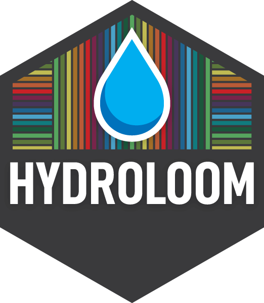

<!-- README.md is generated from README.Rmd. Please edit that file -->

```{r, include = FALSE}
knitr::opts_chunk$set(
  collapse = TRUE,
  comment = "#>",
  fig.path = "man/figures/README-",
  out.width = "100%"
)
```

# hydroloom 

[](https://github.com/DOI-USGS/hydroloom/actions/workflows/R-CMD-check.yaml)
[](https://app.codecov.io/gh/doi-usgs/hydroloom)
[](https://cran.r-project.org/package=hydroloom)

## hydroloom:

**Install:** `install.packages("hydroloom")`

Or for latest development: `remotes::install_github("doi-usgs/hydroloom")`

`hydroloom` is a collection of functions to work with hydrologic geospatial fabrics. Hydroloom is designed to provide general hydrologic network functionality for any hydrographic or hydrologic data. The package is intended for developers of workflows and other packages that require low level network and network data manipulation utilities.

**To Learn More, visit the pkgdown site**: https://doi-usgs.github.io/hydroloom/articles/hydroloom.html

## Citation:

```
Blodgett, D., 2026, hydroloom: Utilities to Weave Hydrologic Fabrics v1.2,
https://doi.org/10.5066/P16RS3UZ
```

Hydroloom has support for attributes that can be seen in:

```{r, eval=FALSE}
hydroloom::hydroloom_name_definitions
```

<details>
  <summary>Click to See Definitions</summary>

```{r, echo=FALSE, eval=TRUE}
knitr::kable(data.frame(Name = names(hydroloom::hydroloom_name_definitions),
  Definition = unname(hydroloom::hydroloom_name_definitions)))
```

</details>

<br/>

`hydroloom` supports your attribute names that map to the in-built definitions. See [`hydroloom_names()`](https://doi-usgs.github.io/hydroloom/reference/hydroloom_names.html) for more.

`hydroloom` supports both dendritic and non-dendritic networks start at [this vignette](https://doi-usgs.github.io/hydroloom/articles/non-dendritic.html) for more.

`hydroloom` was largely created from components of [nhdplusTools](https://doi.org/10.5066/P97AS8JD):

```
Blodgett, D., Johnson, J.M., 2022, nhdplusTools: Tools for
  Accessing and Working with the NHDPlus,
  https://doi.org/10.5066/P97AS8JD
```

`hydroloom` will support some key functionality of `nhdplusTools`. Some components
of `nhdplusTools` will be deprecated in a future version of the package in favor
of the `hydroloom` implementation. In general, `nhdplusTools` will continue to
support web service functionality and particulars of the NHDPlus data model.
In contrast, `hydroloom` is intended to be more general and focused specifically
on hydro fabric data functionality.

`hydroloom` implements algorithms documented in:

NHDPlus Attributes:

```
Moore, R.B., McKay, L.D., Rea, A.H., Bondelid, T.R., Price, C.V., Dewald, T.G.,
  and Johnston, C.M., 2019, User's guide for the national hydrography dataset
  plus (NHDPlus) high resolution: U.S. Geological Survey Open-File Report 2019–1096,
  66 p., https://doi.org/10.3133/ofr20191096.
```

Graph Concepts:

```
Cormen, T. H., & Leiserson, C. E. (2022). Introduction to
  Algorithms, fourth edition. MIT Press.
```

Pfafstetter Attributes:

```
Verdin, K. L., & Verdin, J. P. (1999). A topological system for
  delineation and codification of the Earth's river basins.
  Journal of Hydrology, 218(1–2), 1–12.
  https://doi.org/10.1016/S0022-1694(99)00011-6
```

### Terminology:

The following definitions have been used as much as possible throughout the package.
Terms for rivers:
**Flowline:** A flowline is an linear geometry that represents a segment of a
              flowing body of water. Some flowlines have no local drainage area
              and are never aggregate features.
**Flowpath:** A flowpath is a linear geometry that represents the connection
              between a catchment's inlet and its outlet. All flowpaths have a
              local drainage area and may be aggregates of flowlines.
**Catchment:** A physiographic unit with zero or one inlets and one outlet.
               A catchment is represented by one or more partial realizations;
               flowpath, divide, and networks of flowpaths and divides.
**Catchment Divide:** The polygon boundary that encompasses a catchment.
**Divergence:** The hydrologic nexus (node) where flow diverges. A divergence
                is an abstract location in a hydrologic network.
**Diversion:** A flowline that is below a divergence and is not the primary 
               downstream path. A diversion is a specific feature downstream
               of a divergence.

### Design Notes:

- Hydroloom uses tibble because dplyr verbs for data.frame was dropping the custom hy attributes.
- The `data.table` package is used for some key joins to enhance scalability but dplyr is preferred for clarity.
- `hy` class tibble standardizes all attribute names in code.
- graph representation facilitated by `make_index_ids()`
- names are plural when referring to identifiers and singular when referring to a numerical attribute.

### Build and release:

Development happens on GitHub (DOI-USGS/hydroloom). Official builds and release candidates are produced on code.usgs.gov (code.usgs.gov/water/hydroloom) using GitLab CI.

Vignettes use the `BUILD_VIGNETTES` environment variable to control code evaluation. Set `BUILD_VIGNETTES=TRUE` in a local `.Renviron` to build them with live code; without it every chunk renders as prose and code with no evaluated output. Only `vignettes/hydroloom.Rmd` ships to CRAN. Everything under `vignettes/articles/` is website-only — excluded from the source tarball by `.Rbuildignore` and built by pkgdown. A vignette that needs a web service or a large download belongs in `vignettes/articles/`.

Local development does not require building the source package. Use `devtools::test()`, `devtools::check()`, and `devtools::document()` directly.

Release candidates are built on code.usgs.gov. Push a branch named `rc/<version>` (e.g. `rc/1.2.1`) to trigger the GitLab CI pipeline, which runs three stages:

1. **check** — lightweight structural check with no tests, examples, or vignettes. Gates the rest of the pipeline.
2. **build** — `R CMD build .` to produce the source tarball, which is uploaded to the GitLab generic package registry.
3. **verify** — `R CMD check --as-cran` on the built tarball.

Once the pipeline passes, download the tarball from the package registry and submit it to CRAN. The tarball that CRAN receives is the exact artifact that passed `--as-cran` in CI.

### Release checklist:

- All checks pass and code coverage is adequate
- NEWS.md is up to date
- Disclaimer is in released form
- Version updated in `code.json`
- Push `rc/<version>` branch to code.usgs.gov and confirm the pipeline passes
- Download tarball from the GitLab package registry and submit to CRAN
- After CRAN acceptance:
  - Ensure pkgdown is up to date
  - Commit, push, and PR/MR changes
  - Create release page and tag
  - Attach CRAN tar.gz to release page
  - Update DOI to point to release page
  - Switch README disclaimer back to "dev" mode
  - Bump version in DESCRIPTION

```{r disclaimer, child="DISCLAIMER.md", eval=TRUE}
```

 [
    
  ](https://creativecommons.org/publicdomain/zero/1.0/)
