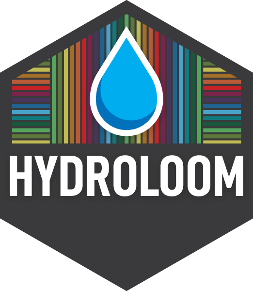

<!-- README.md is generated from README.Rmd. Please edit that file -->

# hydroloom 

[](https://github.com/DOI-USGS/hydroloom/actions/workflows/R-CMD-check.yaml)
[](https://app.codecov.io/gh/doi-usgs/hydroloom)

## hydroloom:

**Install:** remotes::install_github(“doi-usgs/hydroloom”)

`hydroloom` is a collection of functions to work with hydrologic
geospatial fabrics. Hydroloom is designed to provide general hydrologic
network functionality for any hydrographic or hydrologic data. The
package intended for developers of workflows and other packages that
require low level network and network data manipulation utilities.

**To Learn More, visit the pkgdown site**:
<https://doi-usgs.github.io/hydroloom/articles/hydroloom.html>

Hyroloom has support for attributes that can be seen in:

``` r
hydroloom::hydroloom_name_definitions
```

<details>
<summary>
Click to See Definitions
</summary>

| Name                      | Definition                                                                                                                                                                                            |
|:--------------------------|:------------------------------------------------------------------------------------------------------------------------------------------------------------------------------------------------------|
| id                        | shared network identifier for catchment divide and flowpath or flowline                                                                                                                               |
| toid                      | indicates to the downstream id. May or may not be dendritic                                                                                                                                           |
| fromnode                  | indicates the node representing the nexus upstream of a catchment                                                                                                                                     |
| tonode                    | indicates the node representing the nexus downstream of a catchment                                                                                                                                   |
| divergence                | indicates whether a catchment is not downstream of a diversion (0), the primary path downstream of a divergence (1), or a minor path downstream of a diversion (2).                                   |
| wbid                      | waterbody id                                                                                                                                                                                          |
| total_da_sqkm             | total drainage area at the outlet of a catchment                                                                                                                                                      |
| da_sqkm                   | local drainage area of a catchment                                                                                                                                                                    |
| length_km                 | length of a single catchment’s flowpath                                                                                                                                                               |
| pathlength_km             | distance from the outlet of a catchment to the terminal outlet of a network                                                                                                                           |
| arbolate_sum              | total accumulated length of all upstream flowlines                                                                                                                                                    |
| topo_sort                 | Similar to hydrosequence in NHDPlus. Large topo_sort values are upstream of small topo_sort values. Note that there are many valid topological sort orders of a directed graph.                       |
| up_topo_sort              | topo sort value of the upstream mainstem                                                                                                                                                              |
| dn_topo_sort              | topo sort value of the downstream mainstem                                                                                                                                                            |
| dn_minor_topo_sort        | topo sort value of the downstream minor network element with the smallest id                                                                                                                          |
| terminal_topo_sort        | topo sort value of the outlet network element                                                                                                                                                         |
| terminal_flag             | 1 for network terminous 0 for within network                                                                                                                                                          |
| terminal_id               | id of terminal catchment for entire drainage basin                                                                                                                                                    |
| start_flag                | 1 for a headwater, 0 otherwise                                                                                                                                                                        |
| levelpath                 | provides an identifier for the collection of flowpaths that make up a single mainstem flowpath of a drainage basin                                                                                    |
| up_levelpath              | levelpath value of the upstream mainstem                                                                                                                                                              |
| dn_levelpath              | levelpath value of the downstream mainstem                                                                                                                                                            |
| levelpath_outlet_id       | id of outlet catchment of a levelpath                                                                                                                                                                 |
| stream_level              | starting at 1 for coastal terminals and 4 for inland terminals increments by 1 for each smaller tributary level                                                                                       |
| dn_stream_level           | stream level of downstream mainstem network element                                                                                                                                                   |
| stream_order              | starting at 1 for headwaters increments by 1 for each larger tributary level, divergences adopt stream order from upstream but returning divergent network does not increment stream order            |
| stream_calculator         | starting at 1 for headwaters and 0 along diverted paths increments by 1 for each larger tributary level, does no increment along diverted paths. Is equal to stream_order along the dendritic network |
| feature_type              | descriptive feature type moniker                                                                                                                                                                      |
| feature_type_code         | compact feature type identifier                                                                                                                                                                       |
| vector_proc_unit          | identifier for processing units based on vector encapsulation                                                                                                                                         |
| raster_proc_unit          | identifier for processing units based on raster encapsulation                                                                                                                                         |
| id_measure                | interpolative linear reference measure along a single identified feature                                                                                                                              |
| aggregate_id              | aggregate identifier useful for ‘reach’ or ‘flowpath’ aggregation of flowlines                                                                                                                        |
| aggregate_id_measure      | interpolative linear reference measure along an aggregate feature                                                                                                                                     |
| aggregate_id_from_measure | interpolative linear reference for downstream end of a single feature that makes up an aggregate feature                                                                                              |
| aggregate_id_to_measure   | interpolative linear reference for the upstream end of a single feature that makes up an aggregate feature                                                                                            |
| point_id                  | identifier of hydrologic location point                                                                                                                                                               |
| offset                    | offset distance from point to line in units of linear reference analysis units                                                                                                                        |

</details>

<br/>

`hydroloom` supports your attribute names that map to the in-built
definitions. See
[`hydroloom_names()`](https://doi-usgs.github.io/hydroloom/reference/hydroloom_names.html)
for more.

`hydroloom` supports both dendritic and non-dendritic networks start at
[this
vignette](https://doi-usgs.github.io/hydroloom/articles/non-dendritic.html)
for more.

`hydroloom` was largely created from components of
[nhdplusTools](https://doi.org/10.5066/P97AS8JD):

    Blodgett, D., Johnson, J.M., 2022, nhdplusTools: Tools for
      Accessing and Working with the NHDPlus,
      https://doi.org/10.5066/P97AS8JD

`hydroloom` will support some key functionality of `nhdplusTools`. Some
components of `nhdplusTools` will be deprecated in a future version of
the package in favor of the `hydroloom` implementation. In general,
`nhdplusTools` will continue to support web service functionality and
particulars of the NHDPlus data model. In contrast, `hydroloom` is
intended to be more general and focused specifically on hydro fabric
data functionality.

`hydroloom` implements algorithms documented in:

NHDPlus Attributes:

    Moore, R.B., McKay, L.D., Rea, A.H., Bondelid, T.R., Price, C.V., Dewald, T.G., 
      and Johnston, C.M., 2019, User's guide for the national hydrography dataset 
      plus (NHDPlus) high resolution: U.S. Geological Survey Open-File Report 2019–1096, 
      66 p., https://doi.org/10.3133/ofr20191096.

Graph Concepts:

    Cormen, T. H., & Leiserson, C. E. (2022). Introduction to 
      Algorithms, fourth edition. MIT Press.

Pfafstetter Attributes:

    Verdin, K. L., & Verdin, J. P. (1999). A topological system for 
      delineation and codification of the Earth's river basins. 
      Journal of Hydrology, 218(1–2), 1–12. 
      https://doi.org/10.1016/S0022-1694(99)00011-6

### Terminology:

The following definitions have been used as much as possible throughout
the package.  
Terms for rivers:  
**Flowline:** A flowline is an linear geometry that represents a segment
of a flowing body of water. Some flowlines have no local drainage area
and are never aggregate features.  
**Flowpath:** A flowpath is a linear geometry that represents the
connection between a catchment’s inlet and its outlet. All flowpaths
have a local drainage area and may be aggregates of flowlines.  
**Catchment:** A physiographic unit with zero or one inlets and one
outlet. A catchment is represented by one or more partial realizations;
flowpath, divide, and networks of flowpaths and divides.  
**Catchment Divide:** The polygon boundary that encompasses a catchment.

### Design Notes:

- Hydroloom uses tibble because dplyr verbs for data.frame was dropping
  the custom hy attributes.
- The `data.table` package is used for some key joins to enhance
  scalability but dplyr is preferred for clarity.
- `hy` class tibble standardizes all attribute names in code.
- graph representation facilitated by `make_index_ids()` and
  `make_fromids()`
- names are plural when referring to identifiers and singular when
  referring to a numerical attribute.

# Disclaimer

This software is preliminary or provisional and is subject to revision.
It is being provided to meet the need for timely best science. The
software has not received final approval by the U.S. Geological Survey
(USGS). No warranty, expressed or implied, is made by the USGS or the
U.S. Government as to the functionality of the software and related
material nor shall the fact of release constitute any such warranty. The
software is provided on the condition that neither the USGS nor the U.S.
Government shall be held liable for any damages resulting from the
authorized or unauthorized use of the software.

[](https://creativecommons.org/publicdomain/zero/1.0/)
