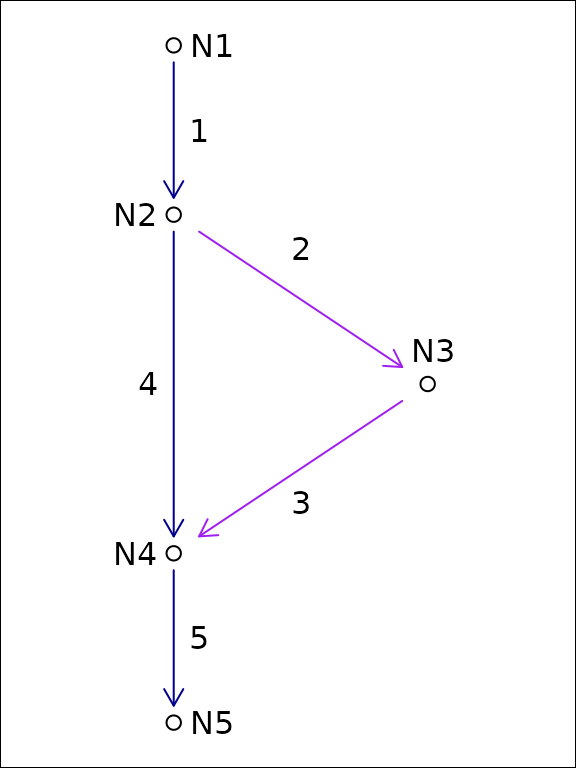
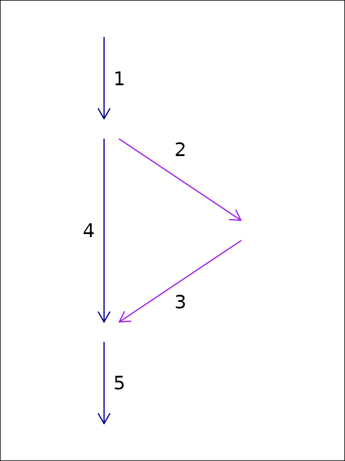

# Hydroloom Overview

## hydroloom

Hydroloom is designed to provide general hydrologic network
functionality for any hydrographic or hydrologic data. This is
accomplished with 1) the `hy` S3 class, 2) a collection of utility
functions, 3) functions to work with a hydrologic network topology as a
graph, 4) functions to create and add useful network attributes, 5) and
functions to index data to a network of flow network lines and waterbody
polygons.

This introduction covers the `hy` S3 class and the core flow network
topology concepts necessary to use hydroloom effectively.

For the latest development and to open issues, please visit the [package
github repository.](https://github.com/DOI-USGS/hydroloom)

## `hy` S3 class

R’s S3 class system attaches a label to a plain object — here, a
`data.frame` — so that generic functions like
[`print()`](https://rdrr.io/r/base/print.html),
[`add_toids()`](https://doi-usgs.github.io/hydroloom/reference/add_toids.md),
or
[`sort_network()`](https://doi-usgs.github.io/hydroloom/reference/sort_network.md)
dispatch to the right method based on that label. An S3 object carries
its labels as the [`class()`](https://rdrr.io/r/base/class.html) vector;
calling `class(x)` shows each label in order from most specific to least
specific. An S3 subclass is an object whose
[`class()`](https://rdrr.io/r/base/class.html) vector starts with a more
specific label and falls back to a more general one, so methods written
for the parent still apply. In hydroloom, an `hy` object is a
`data.frame` with `"hy"` added to its class vector. The subclasses
described below — `hy_topo`, `hy_node`, `hy_flownetwork`, `hy_leveled` —
are `hy` objects with one additional label that tells hydroloom
functions which representation pattern the table follows.

The `hy` S3 class lets hydroloom work directly with existing data.
[`hy()`](https://doi-usgs.github.io/hydroloom/reference/hy.md) converts
a data.frame to an `hy` data.frame with attributes compatible with
`hydroloom` functions.
[`hy_reverse()`](https://doi-usgs.github.io/hydroloom/reference/hy_reverse.md)
converts a `hy` data.frame back to its original attribute names. You can
teach `hydroloom` how to map your attributes to
[`hydroloom_name_definitions()`](https://doi-usgs.github.io/hydroloom/reference/hydroloom_name_definitions.md)
with the
[`hydroloom_names()`](https://doi-usgs.github.io/hydroloom/reference/hydroloom_names.md)
function.

Most `hydroloom` functions will work with either a `hy` object or a
`data.frame` containing names registered with
[`hydroloom_names()`](https://doi-usgs.github.io/hydroloom/reference/hydroloom_names.md).
Any attributes added to the `data.frame` will contain names from
`hydroloom` and must be renamed in the calling environment.

Internally, the `hy` S3 class has an attribute `orig_names` as shown
below. The `orig_names` attribute is used to convert original attribute
names back to their original values. Using the `hydroloom` names and the
`hy` S3 object are not required but adopting
`hydroloom_names_definitions()` may be helpful for people aiming for
consistent, simple, and accurate attribute names.

``` r

library(hydroloom)

hy_net <- sf::read_sf(system.file("extdata/new_hope.gpkg", package = "hydroloom")) |>
  dplyr::select(COMID, REACHCODE, FromNode, ToNode, Hydroseq, TerminalFl, Divergence)

hy(hy_net[1:3, ])

attr(hy(hy_net), "orig_names")
```

## Network Representation

`hydroloom` represents a hydrologic network using three structural
patterns, each captured by an S3 subclass of `hy`:

- `hy_topo` – self-referencing edge list with unique `id` and `toid`
  (dendritic). Most analytic functions
  ([`sort_network()`](https://doi-usgs.github.io/hydroloom/reference/sort_network.md),
  [`add_levelpaths()`](https://doi-usgs.github.io/hydroloom/reference/add_levelpaths.md),
  [`add_streamorder()`](https://doi-usgs.github.io/hydroloom/reference/add_streamorder.md),
  [`accumulate_downstream()`](https://doi-usgs.github.io/hydroloom/reference/accumulate_downstream.md))
  dispatch on this class. See
  [`?hy_topo`](https://doi-usgs.github.io/hydroloom/reference/hy_topo.md).
- `hy_leveled` – a `hy_topo` that additionally carries `topo_sort`,
  `levelpath`, and `levelpath_outlet_id`. Required by
  [`add_pfafstetter()`](https://doi-usgs.github.io/hydroloom/reference/add_pfafstetter.md),
  [`add_streamlevel()`](https://doi-usgs.github.io/hydroloom/reference/add_streamlevel.md),
  and
  [`to_flownetwork()`](https://doi-usgs.github.io/hydroloom/reference/to_flownetwork.md).
  See
  [`?hy_leveled`](https://doi-usgs.github.io/hydroloom/reference/hy_leveled.md).
- `hy_node` – bipartite (edge-node) graph with unique `id`, `fromnode`,
  and `tonode`. Required by
  [`add_divergence()`](https://doi-usgs.github.io/hydroloom/reference/add_divergence.md),
  [`add_return_divergence()`](https://doi-usgs.github.io/hydroloom/reference/add_return_divergence.md),
  and
  [`subset_network()`](https://doi-usgs.github.io/hydroloom/reference/subset_network.md).
  See
  [`?hy_node`](https://doi-usgs.github.io/hydroloom/reference/hy_node.md).
- `hy_flownetwork` – non-dendritic junction table keyed by `id` and
  `toid` (which need not be unique), optionally with `upmain` and
  `downmain`. Required by
  [`navigate_network_dfs()`](https://doi-usgs.github.io/hydroloom/reference/navigate_network_dfs.md)
  for branching navigation. See
  [`?hy_flownetwork`](https://doi-usgs.github.io/hydroloom/reference/hy_flownetwork.md).

[`hy()`](https://doi-usgs.github.io/hydroloom/reference/hy.md) inspects
the columns present in a data.frame and stamps the appropriate subclass
automatically.
[`hy_capabilities()`](https://doi-usgs.github.io/hydroloom/reference/hy_capabilities.md)
reports which hydroloom functions are callable on a given object; it is
demonstrated at each pipeline stage in
[`vignette("network_navigation")`](https://doi-usgs.github.io/hydroloom/articles/network_navigation.md).
The non-dendritic divergence case study lives in
[`vignette("non-dendritic")`](https://doi-usgs.github.io/hydroloom/articles/non-dendritic.md).

### Representing Dendritic Network Topology

A network of flowlines can be represented as an edge-to-edge (e.g. edge
list) or edge-node topology. An edge list only expresses the
connectivity between *edges* (flowlines in the context of rivers),
requiring *nodes* (confluences in the context of rivers) to be inferred.

    #>  id toid fromnode tonode
    #>   1    3       N1     N3
    #>   2    3       N2     N3
    #>   3   NA       N3     N4


In an edge-node topology, edges are directed to nodes which are then
directed to other edges. An edge-to-edge topology does not include
intervening nodes.

A terminal flowline (outlet) is identified by an explicit rule: a row
whose `toid` value is not present in the `id` column. The actual value
can be anything — `0` (the canonical numeric default), `""` (the
canonical character default), `NA`, an arbitrary “no downstream”
reserved value from another data source, or a unique downstream
identifier per outlet.
[`hy()`](https://doi-usgs.github.io/hydroloom/reference/hy.md) replaces
`NA` `toid` values with the canonical reserved value so that user code
comparing `toid` to `0` or `""` works as expected, but downstream
functions detect outlets by the rule (`!toid %in% id`) and do not depend
on the canonical value. Unique-per-outlet identifiers are preserved
through the pipeline, which is useful when outlets must remain
individually addressable.

In `hydroloom`, edge-to-edge topology is referred to with “id and toid”
attributes.

### Representing Non-Dendritic Network Topology

As discussed in the
[`vignette("non-dendritic")`](https://doi-usgs.github.io/hydroloom/articles/non-dendritic.md)
vignette, a hydrologic flow network can be represented as an edge to
edge (e.g. edge list) topology or an edge-node topology. In the case of
dendritic networks, an edge list can be stored as a single “toid”
attribute on each feature and nodes are redundant as there would be one
and only one node for each feature. In non-dendritic networks, an edge
list can include multiple “toid” attributes for each feature,
necessitating a one to many relationship that can be difficult to
interpret. Nevertheless, the U.S. National Hydrography Dataset uses an
edge-list format in its “flow table” and the format is capable of
storing non-dendritic feature topology.

Using a node topology to store a flow network, each feature flows from
one and only one node and flows to one and only one node. This one to
one relationship between features and their from and to nodes means that
the topology fits in a table with one row per feature as is common
practice in spatial feature data.

For this reason, the NHDPlus data model converts the NHD “flow table”
into node topology in its representation of non dendritic topology. The
downside of this approach is that it requires creation of a node
identifier. These node identifiers are a table deduplication device that
enables a one to many relationship (the flow table) to be represented as
two one to one relationships. Given this, in hydrologic flow networks,
node identifiers can be created based on an edge list and discarded when
no longer needed.





In this example of an edge list topology and a node topology for the
same system, feature ‘1’ flows to two edges but only one node. We can
represent this in tabular form with a duplicated row for the divergence
downstream of ‘1’ or with the addition of node identifiers as shown in
the following tables.

| id  | fromnode | tonode |
|-----|----------|--------|
| 1   | N1       | N2     |
| 2   | N2       | N3     |
| 3   | N3       | N4     |
| 4   | N2       | N4     |
| 5   | N4       | N5     |

| id  | toid |
|-----|------|
| 1   | 2    |
| 1   | 4    |
| 2   | 3    |
| 3   | 5    |
| 4   | 5    |
| 5   | 0    |

The same five-edge network can be stamped as each of the three
representations by constructing a data.frame with the appropriate
columns and passing it to
[`hy()`](https://doi-usgs.github.io/hydroloom/reference/hy.md).
[`hy()`](https://doi-usgs.github.io/hydroloom/reference/hy.md) chooses
the subclass based on which columns are present and whether `id` is
unique.

``` r

library(hydroloom)

# bipartite graph: id + fromnode + tonode (unique id)
node_df <- data.frame(
  id       = c(1, 2, 3, 4, 5),
  fromnode = c("N1", "N2", "N3", "N2", "N4"),
  tonode   = c("N2", "N3", "N4", "N4", "N5")
)
class(hy(node_df))
#> [1] "hy_node"    "hy"         "tbl_df"     "tbl"        "data.frame"

# dendritic edge list: id + toid (unique id; secondary path dropped)
topo_df <- data.frame(
  id   = c(1, 2, 3, 4, 5),
  toid = c(2, 3, 5, 5, 0)
)
class(hy(topo_df))
#> [1] "hy_topo"    "hy"         "tbl_df"     "tbl"        "data.frame"

# non-dendritic junction table: id + toid with id repeating
fn_df <- data.frame(
  id   = c(1, 1, 2, 3, 4, 5),
  toid = c(2, 4, 3, 5, 5, 0)
)
class(hy(fn_df))
#> [1] "hy_flownetwork" "tbl_df"         "tbl"            "data.frame"
```

The `hy_node` form preserves both downstream paths from feature 1 via
`fromnode`/`tonode`. The `hy_topo` form is dendritic and keeps only one
downstream connection per id. The `hy_flownetwork` form preserves both
paths by allowing `id` to repeat. See
[`vignette("non-dendritic")`](https://doi-usgs.github.io/hydroloom/articles/non-dendritic.md)
for a worked case study showing how the secondary path is dropped during
the `hy_node` -\> `hy_topo` conversion and preserved in
`hy_flownetwork`.

### Network Graph Representation

The
[`make_index_ids()`](https://doi-usgs.github.io/hydroloom/reference/make_index_ids.md)
`hydroloom` function creates an adjacency matrix representation of a
flow network as well as some convenient content that is useful when
traversing the graph. This adjacency matrix is used heavily in
`hydroloom` functions and may be useful to people who want to write
their own graph traversal algorithms.

In the example below we’ll add a dendritic toid and explore the
[`make_index_ids()`](https://doi-usgs.github.io/hydroloom/reference/make_index_ids.md)
output.

``` r

y <- add_toids(hy_net, return_dendritic = TRUE)

ind_id <- make_index_ids(y)

names(ind_id)

dim(ind_id$to)

max(lengths(ind_id$lengths))

names(ind_id$to_list)

sapply(ind_id, class)
```

Now we’ll look at the same thing but for a non dendritic set of toids.
Notice that the `to` element of `ind_id` now has three rows. This
indicates that one or more of the connections in the matrix has three
downstream neighbors. The `lengths` element indicates how many non `NA`
values are in each column of the matrix in the `to` element.

``` r

y <- add_toids(st_drop_geometry(hy_net), return_dendritic = FALSE)

ind_id <- make_index_ids(y)

names(ind_id)
dim(ind_id$to)

max(ind_id$lengths)

sum(ind_id$lengths == 2)
sum(ind_id$lengths == 3)

names(ind_id$to_list)

sapply(ind_id, class)
```

The default `mode = "to"` produces a downstream-directed graph. Setting
`mode = "from"` inverts the direction so that each column’s entries
point to upstream neighbors instead. The output uses `froms` and
`froms_list` naming to distinguish from the downstream version.

``` r

from_id <- make_index_ids(y, mode = "from")

names(from_id)

dim(from_id$froms)

# a confluence: two upstream connections
max(from_id$lengths)

sum(from_id$lengths == 2)
```

Setting `mode = "both"` returns a list containing both the `to` and
`from` graphs, which is useful when an algorithm needs to traverse the
network in both directions without creating the graph twice.

``` r

both_id <- make_index_ids(y, mode = "both")

names(both_id)

# each direction covers the same set of features
ncol(both_id$to$to) == ncol(both_id$from$froms)
```

### Using the Graph Representation

Most `hydroloom` functions that need a graph create it internally from
`id` and `toid` attributes. Functions like
[`sort_network()`](https://doi-usgs.github.io/hydroloom/reference/sort_network.md),
[`accumulate_downstream()`](https://doi-usgs.github.io/hydroloom/reference/accumulate_downstream.md),
[`add_levelpaths()`](https://doi-usgs.github.io/hydroloom/reference/add_levelpaths.md),
[`add_streamorder()`](https://doi-usgs.github.io/hydroloom/reference/add_streamorder.md),
and
[`subset_network()`](https://doi-usgs.github.io/hydroloom/reference/subset_network.md)
all call
[`make_index_ids()`](https://doi-usgs.github.io/hydroloom/reference/make_index_ids.md)
behind the scenes so users do not need to construct the graph
themselves.

The exception is
[`navigate_network_dfs()`](https://doi-usgs.github.io/hydroloom/reference/navigate_network_dfs.md),
which accepts either a data.frame or a pre-built index_ids list. When
calling
[`navigate_network_dfs()`](https://doi-usgs.github.io/hydroloom/reference/navigate_network_dfs.md)
many times (e.g., starting from every feature in a network), passing a
pre-built graph avoids reconstructing it on each call.

``` r

# navigate_network_dfs creates the graph internally from a data.frame
navigate_network_dfs(y, starts = y$id[1], direction = "down")

# or accept pre-built index ids -- use "to" for downstream, "from" for upstream
to_index <- make_index_ids(y, mode = "to")
navigate_network_dfs(to_index, starts = y$id[1], direction = "down")

from_index <- make_index_ids(y, mode = "from")
navigate_network_dfs(from_index, starts = y$id[1], direction = "up")
```
