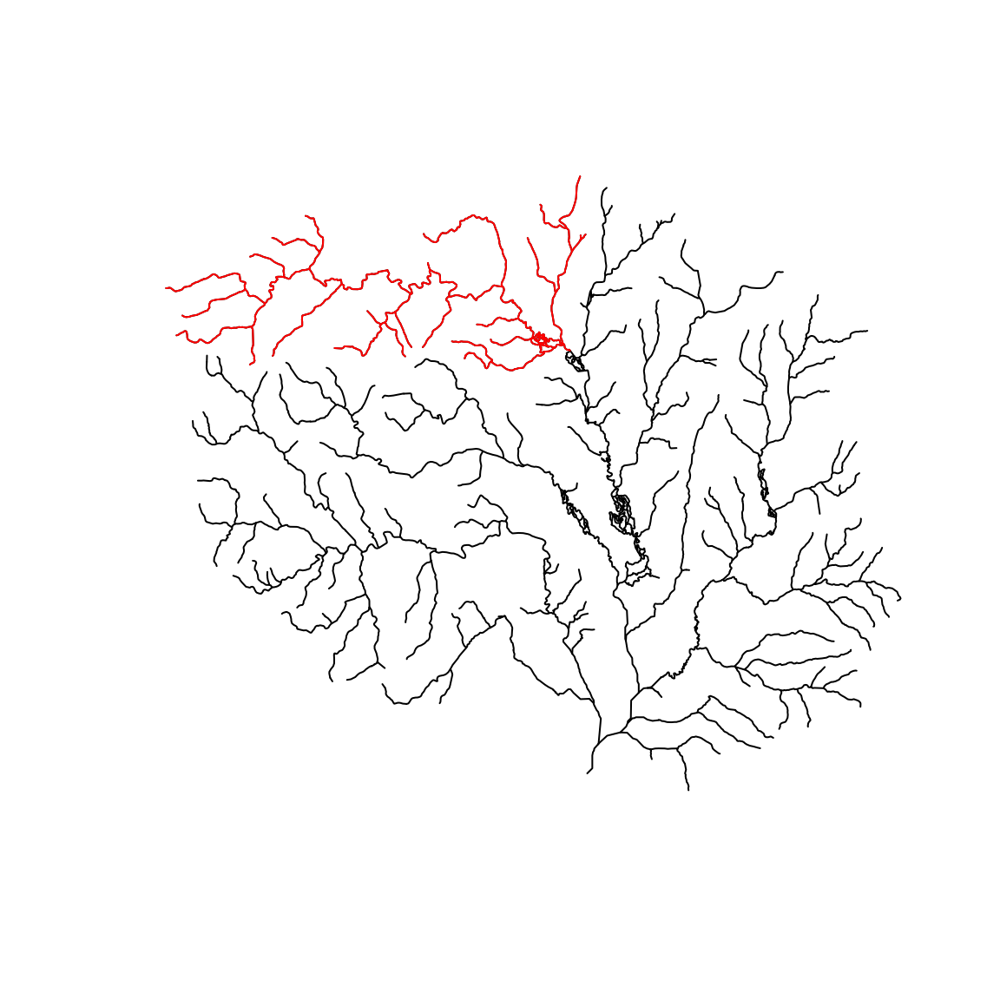
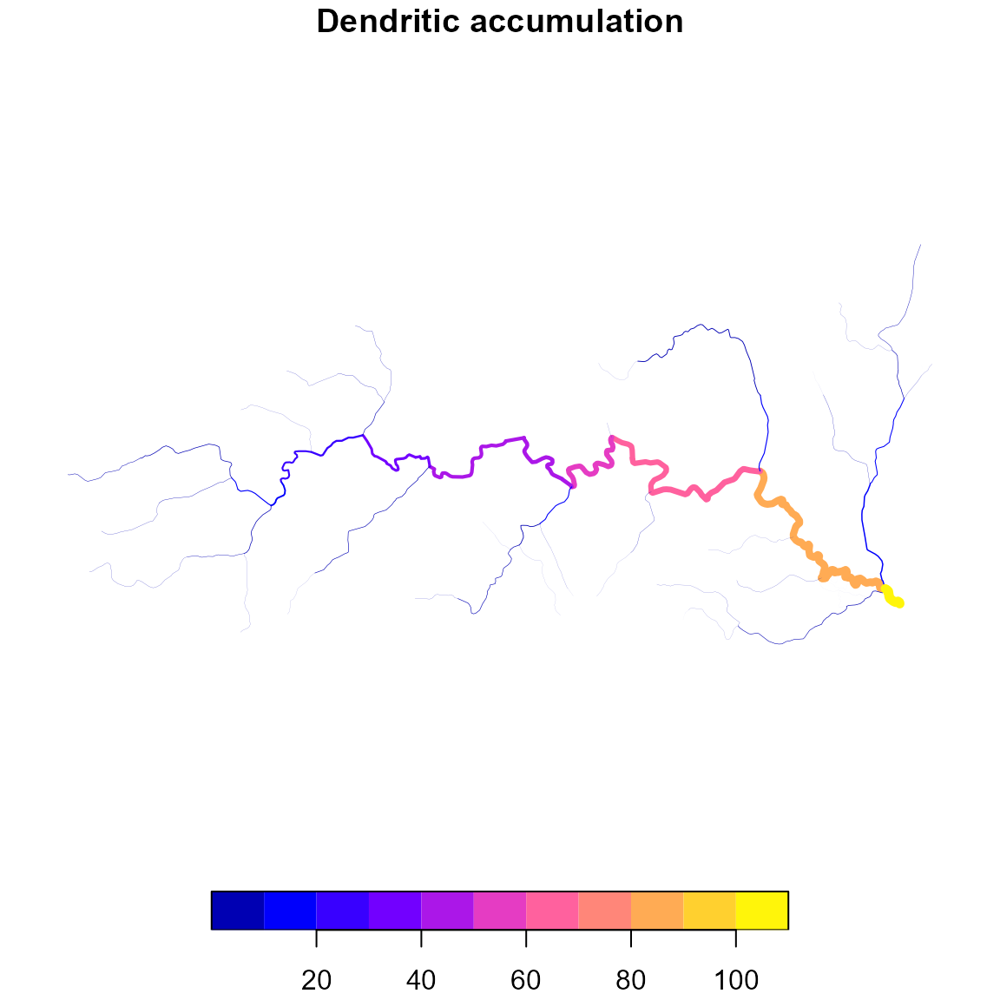
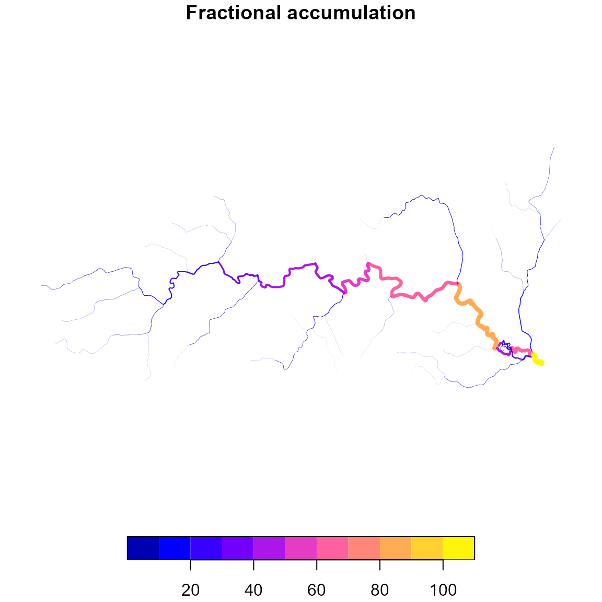
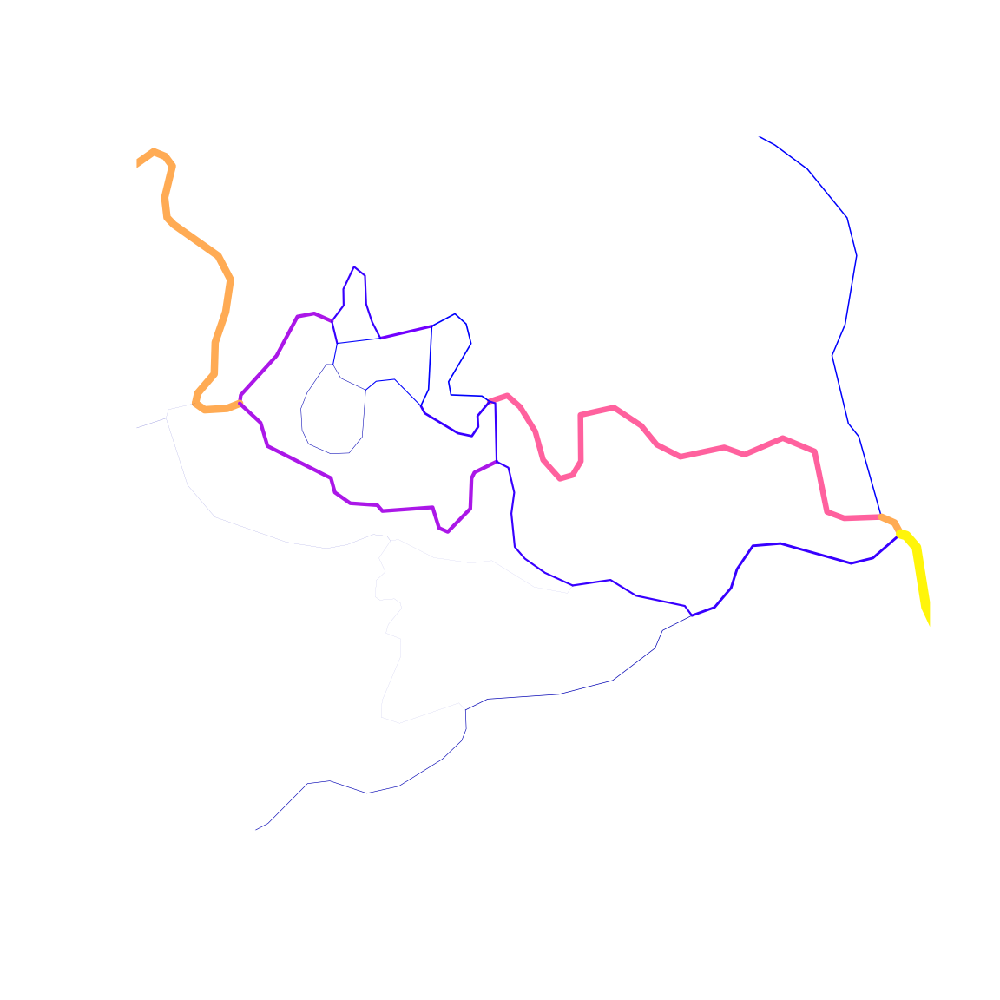
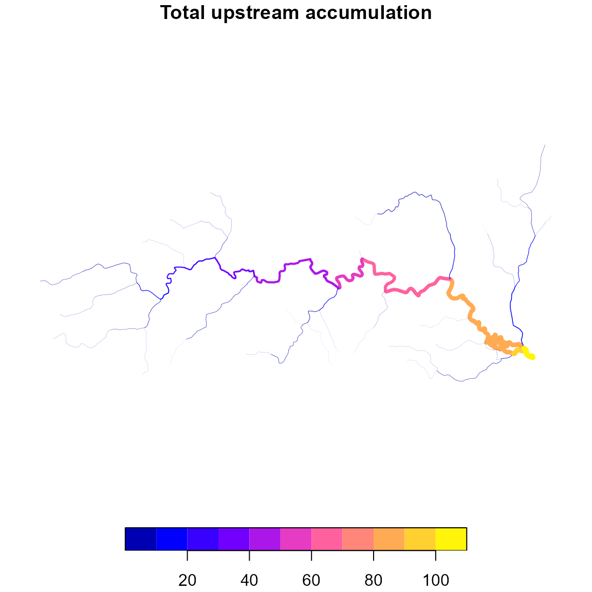
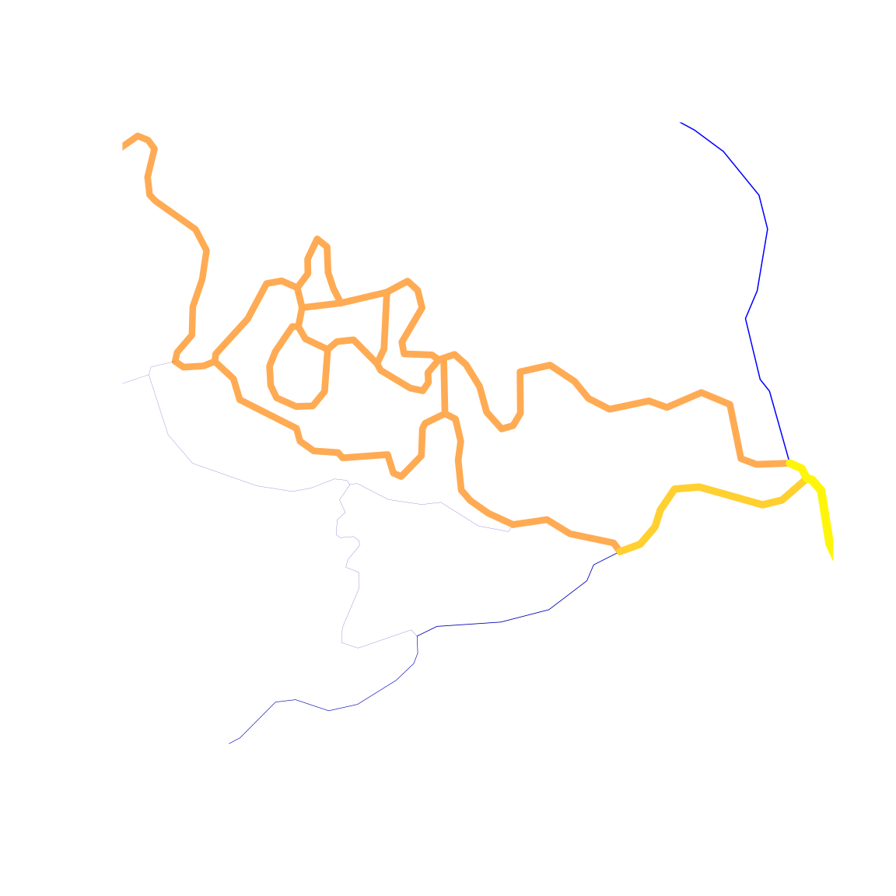

# Downstream Accumulation

## Introduction

A common task in hydrologic network analysis is accumulating a catchment
attribute along the network – summing up a local quantity from
headwaters to outlet. For example, adding up the drainage area of every
catchment upstream of a given point to get total drainage area, or
accumulating precipitation volume to get a basin-wide average.

[`accumulate_downstream()`](https://doi-usgs.github.io/hydroloom/reference/accumulate_downstream.md)
provides three modes for this operation, each handling diversions
(non-dendritic flow splits) differently. This article demonstrates all
three modes using the sample data included with `hydroloom`. For
background on non-dendritic network concepts, see
[`vignette("non-dendritic")`](https://doi-usgs.github.io/hydroloom/articles/non-dendritic.md).

## Sample data

We’ll use the “New Hope” sample watershed included with `hydroloom`.
First, we prepare a network with the required topology attributes.

``` r
net <- sf::read_sf(system.file("extdata/new_hope.gpkg", package = "hydroloom"))

# subset to a connected upstream basin
x <- subset_network(net, 8893236)

plot(sf::st_geometry(net))
plot(sf::st_geometry(x), col = "red", add = TRUE)
```



## Three accumulation modes

[`accumulate_downstream()`](https://doi-usgs.github.io/hydroloom/reference/accumulate_downstream.md)
supports three modes that differ in how they handle flow splits
(divergences) in the network. The `total` parameter and the presence or
absence of a `divergence_fraction` attribute control which mode is used.

### 1. Dendritic (default)

When `total = FALSE` and no `divergence_fraction` attribute is present,
diversions receive none of the upstream value – they are treated as if
they are headwaters. This is the simplest mode and is appropriate when
working with a strictly dendritic representation of the network or an
assumption of 0 contribution of the quantity to diversions is
appropriate.

``` r
# add_toids creates a dendritic edge list (id/toid)
x$dend_totdasqkm <- accumulate_downstream(add_toids(x, return_dendritic = TRUE), "AreaSqKM")
#> Dendritic routing will be applied. Diversions are assumed to have 0 flow fraction.

# diversions reset to their own local area
plot(x["dend_totdasqkm"], lwd = x$dend_totdasqkm / 20,
  main = "Dendritic accumulation")
```



### 2. Fractional (divergence apportioned)

When `total = FALSE` and a `divergence_fraction` attribute is present,
each downstream path at a divergence receives a fraction of the upstream
value. The fractions should sum to 1 across all paths leaving a
divergence.

In the example below, we create a simple equal-split fraction: each path
gets `1 / n` where `n` is the number of paths leaving a node. More
realistic fractions could come from observed flow data or a model.

``` r
y <- x |>
  group_by(FromNode) |>
  # split evenly among downstream flowlines
  mutate(divergence_fraction = 1 / max(n())) |>
  ungroup()

y$frac_totdasqkm <- accumulate_downstream(y, "AreaSqKM")

# diversions now carry a fraction of upstream area
plot(y["frac_totdasqkm"], lwd = y$frac_totdasqkm / 20,
  main = "Fractional accumulation")
```



``` r

# zoom in to see what's going on at diversions
plot(sf::st_geometry(y[y$COMID %in% c("8893210", "8893222"), ]), col = NA)
plot(y["frac_totdasqkm"], lwd = y$frac_totdasqkm / 20,
  main = "Fractional accumulation", add = TRUE)
```



### 3. Total upstream (no apportionment)

When `total = TRUE`, every downstream path gets the full upstream value.
Where diversions rejoin the main flow, the algorithm avoids double
counting the shared upstream area. This mode requires `fromnode`,
`tonode`, and `divergence` attributes.

This mode reproduces the total drainage area values in NHDPlusV2.

``` r
z <- x |>
  select(COMID, FromNode, ToNode, Divergence, AreaSqKM, TotDASqKM)

z$tot_totdasqkm <- accumulate_downstream(z, "AreaSqKM", total = TRUE)

plot(z["tot_totdasqkm"], lwd = z$tot_totdasqkm / 20,
  main = "Total upstream accumulation")
```



``` r

# zoom in to see what's going on at diversions
plot(sf::st_geometry(y[y$COMID %in% c("8893210", "8893222"), ]), col = NA)
plot(z["tot_totdasqkm"], lwd = z$tot_totdasqkm / 20,
  main = "Total upstream accumulation", add = TRUE)
```



``` r

# matches NHDPlusV2 total drainage area
any(abs(z$tot_totdasqkm - z$TotDASqKM) > 0.001)
#> [1] FALSE
```

## Accumulating derived quantities

Total upstream accumulation is not limited to area. Any catchment-level
quantity can be accumulated. A common pattern is to compute a volume
(e.g., precipitation depth times area) at each catchment, accumulate the
volume downstream, then divide by total drainage area to get an
area-weighted average.

The example below demonstrates this with the mean annual precipitation
attribute from .

``` r
suppressWarnings(
ppt7100 <- nhdplusTools::get_catchment_characteristics(c("CAT_PPT7100_ANN", "TOT_PPT7100_ANN"), ids = x$COMID)
)

ppt7100 <- tidyr::pivot_wider(ppt7100, names_from = "characteristic_id", values_from = "characteristic_value")

x <- left_join(x, ppt7100, by = c("COMID" = "comid"))

# mean annual precipitation is already on the sample data
# CAT_PPT7100_ANN is the local catchment mean (mm)
# TOT_PPT7100_ANN is the pre-computed total upstream mean (mm)
w <- x |>
  select(COMID, FromNode, ToNode, Divergence,
    AreaSqKM, CAT_PPT7100_ANN, TOT_PPT7100_ANN)

# local precipitation volume = depth * area
w$cat_ppt_vol <- w$CAT_PPT7100_ANN * w$AreaSqKM

# accumulate volume, then divide by total area for area-weighted mean
w$total_da_sqkm <- accumulate_downstream(w, "AreaSqKM", total = TRUE)
w$tot_ppt_vol <- accumulate_downstream(w, "cat_ppt_vol", total = TRUE)
w$tot_ppt <- w$tot_ppt_vol / w$total_da_sqkm

# note that all differences from the source estimate are within rounding error
range(w$TOT_PPT7100_ANN - w$tot_ppt, na.rm = TRUE)
#> [1] -0.005892899  0.007038627
```

## Choosing a mode

| Mode | `total` | `divergence_fraction` | Use when |
|----|----|----|----|
| Dendritic | `FALSE` | absent | Working with a dendritic-only network or diversions can be ignored |
| Fractional | `FALSE` | present | You have or can estimate flow fractions at each divergence |
| Total upstream | `TRUE` | ignored | You need the full upstream value without apportionment (e.g., total drainage area) |
