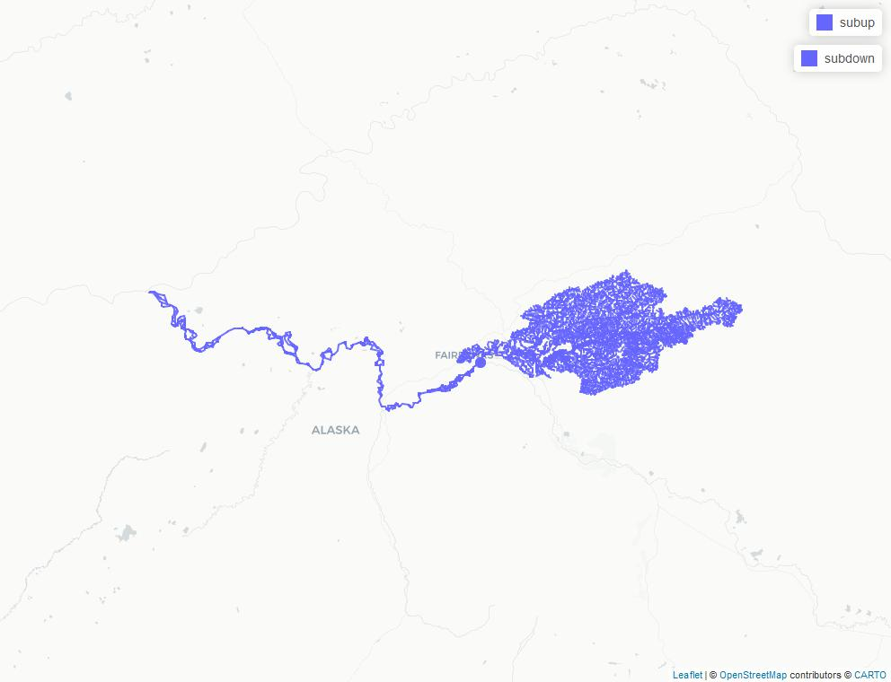

# NHD Flow Table with Hydroloom

This article demonstrates how to work with the NHD flow table using
nhdplusTools and hydroloom.

In this first block, we will download, open, and filter the data to
prepare to work with it as a network.

``` r
library(hydroloom)
library(dplyr)

dir <- nhdplusTools::download_nhd(nhdplusTools::nhdplusTools_data_dir(),
  "1908", TRUE)
#>   |                                                                              |                                                                      |   0%  |                                                                              |                                                                      |   1%  |                                                                              |=                                                                     |   1%  |                                                                              |=                                                                     |   2%  |                                                                              |==                                                                    |   2%  |                                                                              |==                                                                    |   3%  |                                                                              |==                                                                    |   4%  |                                                                              |===                                                                   |   4%  |                                                                              |===                                                                   |   5%  |                                                                              |====                                                                  |   5%  |                                                                              |====                                                                  |   6%  |                                                                              |=====                                                                 |   6%  |                                                                              |=====                                                                 |   7%  |                                                                              |=====                                                                 |   8%  |                                                                              |======                                                                |   8%  |                                                                              |======                                                                |   9%  |                                                                              |=======                                                               |   9%  |                                                                              |=======                                                               |  10%  |                                                                              |=======                                                               |  11%  |                                                                              |========                                                              |  11%  |                                                                              |========                                                              |  12%  |                                                                              |=========                                                             |  12%  |                                                                              |=========                                                             |  13%  |                                                                              |=========                                                             |  14%  |                                                                              |==========                                                            |  14%  |                                                                              |==========                                                            |  15%  |                                                                              |===========                                                           |  15%  |                                                                              |===========                                                           |  16%  |                                                                              |============                                                          |  16%  |                                                                              |============                                                          |  17%  |                                                                              |============                                                          |  18%  |                                                                              |=============                                                         |  18%  |                                                                              |=============                                                         |  19%  |                                                                              |==============                                                        |  19%  |                                                                              |==============                                                        |  20%  |                                                                              |==============                                                        |  21%  |                                                                              |===============                                                       |  21%  |                                                                              |===============                                                       |  22%  |                                                                              |================                                                      |  22%  |                                                                              |================                                                      |  23%  |                                                                              |================                                                      |  24%  |                                                                              |=================                                                     |  24%  |                                                                              |=================                                                     |  25%  |                                                                              |==================                                                    |  25%  |                                                                              |==================                                                    |  26%  |                                                                              |===================                                                   |  26%  |                                                                              |===================                                                   |  27%  |                                                                              |===================                                                   |  28%  |                                                                              |====================                                                  |  28%  |                                                                              |====================                                                  |  29%  |                                                                              |=====================                                                 |  29%  |                                                                              |=====================                                                 |  30%  |                                                                              |=====================                                                 |  31%  |                                                                              |======================                                                |  31%  |                                                                              |======================                                                |  32%  |                                                                              |=======================                                               |  32%  |                                                                              |=======================                                               |  33%  |                                                                              |=======================                                               |  34%  |                                                                              |========================                                              |  34%  |                                                                              |========================                                              |  35%  |                                                                              |=========================                                             |  35%  |                                                                              |=========================                                             |  36%  |                                                                              |==========================                                            |  36%  |                                                                              |==========================                                            |  37%  |                                                                              |==========================                                            |  38%  |                                                                              |===========================                                           |  38%  |                                                                              |===========================                                           |  39%  |                                                                              |============================                                          |  39%  |                                                                              |============================                                          |  40%  |                                                                              |============================                                          |  41%  |                                                                              |=============================                                         |  41%  |                                                                              |=============================                                         |  42%  |                                                                              |==============================                                        |  42%  |                                                                              |==============================                                        |  43%  |                                                                              |==============================                                        |  44%  |                                                                              |===============================                                       |  44%  |                                                                              |===============================                                       |  45%  |                                                                              |================================                                      |  45%  |                                                                              |================================                                      |  46%  |                                                                              |=================================                                     |  46%  |                                                                              |=================================                                     |  47%  |                                                                              |=================================                                     |  48%  |                                                                              |==================================                                    |  48%  |                                                                              |==================================                                    |  49%  |                                                                              |===================================                                   |  49%  |                                                                              |===================================                                   |  50%  |                                                                              |===================================                                   |  51%  |                                                                              |====================================                                  |  51%  |                                                                              |====================================                                  |  52%  |                                                                              |=====================================                                 |  52%  |                                                                              |=====================================                                 |  53%  |                                                                              |=====================================                                 |  54%  |                                                                              |======================================                                |  54%  |                                                                              |======================================                                |  55%  |                                                                              |=======================================                               |  55%  |                                                                              |=======================================                               |  56%  |                                                                              |========================================                              |  56%  |                                                                              |========================================                              |  57%  |                                                                              |========================================                              |  58%  |                                                                              |=========================================                             |  58%  |                                                                              |=========================================                             |  59%  |                                                                              |==========================================                            |  59%  |                                                                              |==========================================                            |  60%  |                                                                              |==========================================                            |  61%  |                                                                              |===========================================                           |  61%  |                                                                              |===========================================                           |  62%  |                                                                              |============================================                          |  62%  |                                                                              |============================================                          |  63%  |                                                                              |============================================                          |  64%  |                                                                              |=============================================                         |  64%  |                                                                              |=============================================                         |  65%  |                                                                              |==============================================                        |  65%  |                                                                              |==============================================                        |  66%  |                                                                              |===============================================                       |  66%  |                                                                              |===============================================                       |  67%  |                                                                              |===============================================                       |  68%  |                                                                              |================================================                      |  68%  |                                                                              |================================================                      |  69%  |                                                                              |=================================================                     |  69%  |                                                                              |=================================================                     |  70%  |                                                                              |=================================================                     |  71%  |                                                                              |==================================================                    |  71%  |                                                                              |==================================================                    |  72%  |                                                                              |===================================================                   |  72%  |                                                                              |===================================================                   |  73%  |                                                                              |===================================================                   |  74%  |                                                                              |====================================================                  |  74%  |                                                                              |====================================================                  |  75%  |                                                                              |=====================================================                 |  75%  |                                                                              |=====================================================                 |  76%  |                                                                              |======================================================                |  76%  |                                                                              |======================================================                |  77%  |                                                                              |======================================================                |  78%  |                                                                              |=======================================================               |  78%  |                                                                              |=======================================================               |  79%  |                                                                              |========================================================              |  79%  |                                                                              |========================================================              |  80%  |                                                                              |========================================================              |  81%  |                                                                              |=========================================================             |  81%  |                                                                              |=========================================================             |  82%  |                                                                              |==========================================================            |  82%  |                                                                              |==========================================================            |  83%  |                                                                              |==========================================================            |  84%  |                                                                              |===========================================================           |  84%  |                                                                              |===========================================================           |  85%  |                                                                              |============================================================          |  85%  |                                                                              |============================================================          |  86%  |                                                                              |=============================================================         |  86%  |                                                                              |=============================================================         |  87%  |                                                                              |=============================================================         |  88%  |                                                                              |==============================================================        |  88%  |                                                                              |==============================================================        |  89%  |                                                                              |===============================================================       |  89%  |                                                                              |===============================================================       |  90%  |                                                                              |===============================================================       |  91%  |                                                                              |================================================================      |  91%  |                                                                              |================================================================      |  92%  |                                                                              |=================================================================     |  92%  |                                                                              |=================================================================     |  93%  |                                                                              |=================================================================     |  94%  |                                                                              |==================================================================    |  94%  |                                                                              |==================================================================    |  95%  |                                                                              |===================================================================   |  95%  |                                                                              |===================================================================   |  96%  |                                                                              |====================================================================  |  96%  |                                                                              |====================================================================  |  97%  |                                                                              |====================================================================  |  98%  |                                                                              |===================================================================== |  98%  |                                                                              |===================================================================== |  99%  |                                                                              |======================================================================|  99%  |                                                                              |======================================================================| 100%
fs <- list.files(dir, pattern = ".*1908.*.gdb", full.names = TRUE)

# Dropping Z and M and making sure everything is LINESTRING helps later.
fl <- sf::st_cast(sf::st_zm(sf::read_sf(fs, "NHDFlowline"), "LINESTRING"))

# remove any coastal (ftype 566) features
fl <- filter(fl, ftype != 566)
```

Now that we have a network ready to go, we need to figure out a subset
that we want to work with. Here, we’ll use
[`index_points_to_lines()`](https://doi-usgs.github.io/hydroloom/reference/index_points_to_lines.md)
to find a line near the outlet of the Chena River in Alaska.

``` r
# this is a seed point near the outlet of a watershed to consider.
point <- sf::st_sfc(sf::st_point(c(-147.911472, 64.796633)),
  crs = 4269)

# now we get the line our point is along.
i <- index_points_to_lines(fl, point)

# Let's see what we have.
sub <- fl[fl$permanent_identifier == i$permanent_identifier, ]

mapview::mapview(list(sub, point))
```

Now we load up the NHD “flow table” which contains a list of connections
between flowlines. Where there are diversions, the same “from” will have
multiple “to” connections so this table doesn’t join cleanly to the
flowline table. The following code prepares the flow table and runs a
network navigation over it to find all the features we need.

Note that in
[`check_hy_graph()`](https://doi-usgs.github.io/hydroloom/reference/check_hy_graph.md)
we are only finding flowlines that flow directly into eachother, not
loops of three or more features. We can search for loops like that with
the `loop_check` flag to `check_hy_graph` but don’t need it to get
[`navigate_network_dfs()`](https://doi-usgs.github.io/hydroloom/reference/navigate_network_dfs.md)
to work.

``` r
# remove coastal and make terminals go to an empty id.
flow_table <- sf::read_sf(fs, "NHDFlow") |>
  filter(from_permanent_identifier %in% fl$permanent_identifier) |>
  mutate(to_permanent_identifier =
    ifelse(!to_permanent_identifier %in% from_permanent_identifier,
      "",
      to_permanent_identifier))

# Remove loops found in navigate network dfs
remove <- hydroloom::check_hy_graph(flow_table)

# this is naive and these removals would normally be reviewed.
flow_table <- flow_table |>
  mutate(row = seq_len(n())) |>
  filter(!row %in% remove$row)

down <- navigate_network_dfs(flow_table, sub$permanent_identifier, direction = "down")
up <- navigate_network_dfs(flow_table, sub$permanent_identifier, direction = "up")

subdown <- fl[fl$permanent_identifier %in% unique(unlist(down)), ]
subup <- fl[fl$permanent_identifier %in% unique(unlist(up)), ]

map_image <- "flow-table-fig.jpeg"
map <- mapview::mapview(list(subup, subdown, point))
mapview::mapviewOptions(fgb = FALSE)
mapview::mapshot(map, file = map_image)
knitr::include_graphics(map_image)
```



There’s plenty more we could do from here, but this vignette shows the
core of what’s needed to get the NHD flow table working with hydroloom.

Looking for help or want more in this vignette? Submit an issue at:
<https://github.com/DOI-USGS/hydroloom/issues>
