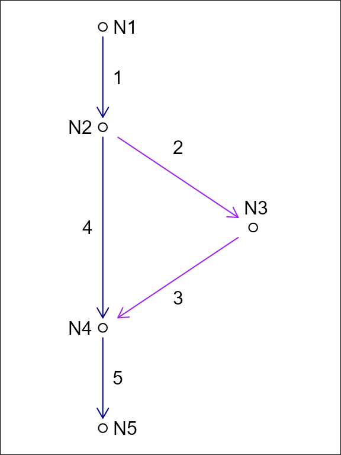
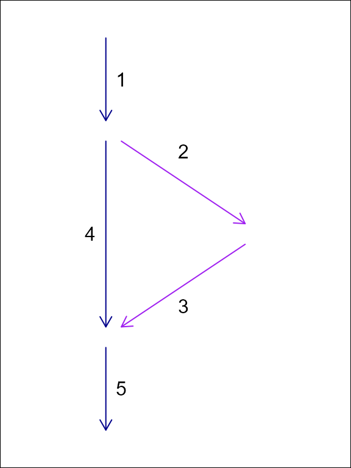

# Hydroloom Overview

## hydroloom

Hydroloom is designed to provide general hydrologic network
functionality for any hydrographic or hydrologic data. This is
accomplished with 1) the `hy` S3 class, 2) a collection of utility
functions, 3) functions to work with a hydrologic network topology as a
graph, 4) functions to create and add useful network attributes, 5) and
functions to index data to a network of flow network lines and waterbody
polygons.

This introduction covers the `hy` S3 class and the core flow network
topology concepts necessary to use hydroloom effectively.

For the latest development and to open issues, please visit the [package
github repository.](https://github.com/DOI-USGS/hydroloom)

## `hy` S3 class

Hydroloom implements an `hy` S3 class designed to simplify integration
of `hydroloom` with existing data and workflows.
[`hy()`](https://doi-usgs.github.io/hydroloom/reference/hy.md) converts
a data.frame to an `hy` `data.frame` with attributes compatible with
`hydroloom` functions.
[`hy_reverse()`](https://doi-usgs.github.io/hydroloom/reference/hy_reverse.md)
converts a `hy` `data.frame` back to its original attribute names. You
can teach `hydroloom` how to map your attributes to
[`hydroloom_name_definitions()`](https://doi-usgs.github.io/hydroloom/reference/hydroloom_name_definitions.md)
with the
[`hydroloom_names()`](https://doi-usgs.github.io/hydroloom/reference/hydroloom_names.md)
function.

Most `hydroloom` functions will work with either a `hy` object or a
`data.frame` containing names registered with
[`hydroloom_names()`](https://doi-usgs.github.io/hydroloom/reference/hydroloom_names.md).
Any attributes added to the `data.frame` will contain names from
`hydroloom` and must be renamed in the calling environment.

Internally, the `hy` S3 class has an attribute `orig_names` as shown
below. The `orig_names` attribute is used to convert original attribute
names back to their original values. Using the `hydroloom` names and the
`hy` S3 object are not required but adopting
`hydroloom_names_definitions()` may be helpful for people aiming for
consistent, simple, and accurate attribute names.

``` r
library(hydroloom)

hy_net <- sf::read_sf(system.file("extdata/new_hope.gpkg", package = "hydroloom")) |>
  dplyr::select(COMID, REACHCODE, FromNode, ToNode, Hydroseq, TerminalFl, Divergence)

hy(hy_net[1:3, ])
#> Simple feature collection with 3 features and 7 fields
#> Geometry type: MULTILINESTRING
#> Dimension:     XY
#> Bounding box:  xmin: 1517192 ymin: 1555954 xmax: 1518702 ymax: 1557298
#> Projected CRS: +proj=aea +lat_0=23 +lon_0=-96 +lat_1=29.5 +lat_2=45.5 +x_0=0 +y_0=0 +ellps=GRS80 +towgs84=0,0,0,0,0,0,0 +units=m +no_defs
#> # A tibble: 3 × 8
#>        id aggregate_id    fromnode    tonode topo_sort terminal_flag divergence
#>     <int> <chr>              <dbl>     <dbl>     <dbl>         <int>      <int>
#> 1 8893864 03030002000018 250031721 250031853 250016373             0          0
#> 2 8894490 03030002000018 250031895 250031854 250015665             0          0
#> 3 8894494 03030002000018 250031897 250031895 250015826             0          0
#> # ℹ 1 more variable: geom <MULTILINESTRING [m]>

attr(hy(hy_net), "orig_names")
#>           COMID       REACHCODE        FromNode          ToNode        Hydroseq 
#>            "id"  "aggregate_id"      "fromnode"        "tonode"     "topo_sort" 
#>      TerminalFl      Divergence            geom 
#> "terminal_flag"    "divergence"          "geom"
```

## Network Representation

### Representing Dendritic Network Topology

A network of flowlines can be represented as an edge-to-edge (e.g. edge
list) or edge-node topology. An edge list only expresses the
connectivity between *edges* (flowlines in the context of rivers),
requiring *nodes* (confluences in the context of rivers) to be inferred.

    #>  id toid fromnode tonode
    #>   1    3       N1     N3
    #>   2    3       N2     N3
    #>   3   NA       N3     N4


In an edge-node topology, edges are directed to nodes which are then
directed to other edges. An edge-to-edge toplogy does not include
intervening nodes.

The “toid” of a terminal flowline can be either NA or, by convention, 0
or ““. Using 0 or an empty string is preferred within `hydroloom` but
both are handled in most cases. Further, as long as 0 is not in the set
of IDs, there is little practical difference.

In `hydroloom`, edge-to-edge topology is referred to with “id and toid”
attributes.

### Representing Non-Dendritic Network Topology

As discussed in the
[`vignette("non-dendritic")`](https://doi-usgs.github.io/hydroloom/articles/non-dendritic.md)
vignette, a hydrologic flow network can be represented as an edge to
edge (e.g. edge list) topology or an edge-node topology. In the case of
dendritic networks, an edge list can be stored as a single “toid”
attribute on each feature and nodes are redundant as there would be one
and only one node for each feature. In non-dendritic networks, an edge
list can include multiple “toid” attributes for each feature,
necessitating a one to many relationship that can be difficult to
interpret. Nevertheless, the U.S. National Hydrography Dataset uses an
edge-list format in its “flow table” and the format is capable of
storing non-dendritic feature topology.

Using a node topology to store a flow network, each feature flows from
one and only one node and flows to one and only one node. This one to
one relationship between features and their from and to nodes means that
the topology fits in a table with one row per feature as is common
practice in spatial feature data.

For this reason, the NHDPlus data model converts the NHD “flow table”
into node topology in its representation of non dendritic topology. The
downside of this approach is that it requires creation of a node
identifier. These node identifiers are a table deduplication device that
enables a one to many relationship (the flow table) to be represented as
two one to one relationships. Given this, in hydrologic flow networks,
node identifiers can be created based on an edge list and discarded when
no longer needed.





In this example of an edge list topology and a node topology for the
same system, feature ‘1’ flows to two edges but only one node. We can
represent this in tabular form with a duplicated row for the divergence
downstream of ‘1’ or with the addition of node identifiers as shown in
the following tables.

| id  | fromnode | tonode |
|-----|----------|--------|
| 1   | N1       | N2     |
| 2   | N2       | N3     |
| 3   | N3       | N4     |
| 4   | N2       | N4     |
| 5   | N4       | N5     |

| id  | toid |
|-----|------|
| 1   | 2    |
| 1   | 4    |
| 2   | 3    |
| 3   | 5    |
| 4   | 5    |
| 5   | 0    |

### Network Graph Representation

The
[`make_index_ids()`](https://doi-usgs.github.io/hydroloom/reference/make_index_ids.md)
`hydroloom` function creates an adjacency matrix representation of a
flow network as well as some convenient content that is useful when
traversing the graph. This adjacency matrix is used heavily in
`hydroloom` functions and may be useful to people who want to write
their own graph traversal algorithms.

In the example below we’ll add a dendritic toid and explore the
[`make_index_ids()`](https://doi-usgs.github.io/hydroloom/reference/make_index_ids.md)
output.

``` r
y <- add_toids(hy_net, return_dendritic = TRUE)

ind_id <- make_index_ids(y)

names(ind_id)
#> [1] "to"      "lengths" "to_list"

dim(ind_id$to)
#> [1]   1 746

max(lengths(ind_id$lengths))
#> [1] 1

names(ind_id$to_list)
#> [1] "id"      "indid"   "toindid"

sapply(ind_id, class)
#> $to
#> [1] "matrix" "array" 
#> 
#> $lengths
#> [1] "numeric"
#> 
#> $to_list
#> [1] "data.frame"
```

Now we’ll look at the same thing but for a non dendritic set of toids.
Notice that the `to` element of `ind_id` now has three rows. This
indicates that one or more of the connections in the matrix has three
downstream neighbors. The `lengths` element indicates how many non `NA`
values are in each column of the matrix in the `to` element.

``` r
y <- add_toids(st_drop_geometry(hy_net), return_dendritic = FALSE)

ind_id <- make_index_ids(y)

names(ind_id)
#> [1] "to"      "lengths" "to_list"
dim(ind_id$to)
#> [1]   3 746

max(ind_id$lengths)
#> [1] 3

sum(ind_id$lengths == 2)
#> [1] 84
sum(ind_id$lengths == 3)
#> [1] 1

names(ind_id$to_list)
#> [1] "id"      "indid"   "toindid"

sapply(ind_id, class)
#> $to
#> [1] "matrix" "array" 
#> 
#> $lengths
#> [1] "numeric"
#> 
#> $to_list
#> [1] "data.frame"
```

The default `mode = "to"` produces a downstream-directed graph. Setting
`mode = "from"` inverts the direction so that each column’s entries
point to upstream neighbors instead. The output uses `froms` and
`froms_list` naming to distinguish from the downstream version.

``` r
from_id <- make_index_ids(y, mode = "from")

names(from_id)
#> [1] "froms"      "lengths"    "froms_list"

dim(from_id$froms)
#> [1]   3 746

# a confluence: two upstream connections
max(from_id$lengths)
#> [1] 3

sum(from_id$lengths == 2)
#> [1] 227
```

Setting `mode = "both"` returns a list containing both the `to` and
`from` graphs, which is useful when an algorithm needs to traverse the
network in both directions without creating the graph twice.

``` r
both_id <- make_index_ids(y, mode = "both")

names(both_id)
#> [1] "to"   "from"

# each direction covers the same set of features
ncol(both_id$to$to) == ncol(both_id$from$froms)
#> [1] TRUE
```

### Using the Graph Representation

Most `hydroloom` functions that need a graph create it internally from
`id` and `toid` attributes. Functions like
[`sort_network()`](https://doi-usgs.github.io/hydroloom/reference/sort_network.md),
[`accumulate_downstream()`](https://doi-usgs.github.io/hydroloom/reference/accumulate_downstream.md),
[`add_levelpaths()`](https://doi-usgs.github.io/hydroloom/reference/add_levelpaths.md),
[`add_streamorder()`](https://doi-usgs.github.io/hydroloom/reference/add_streamorder.md),
and
[`subset_network()`](https://doi-usgs.github.io/hydroloom/reference/subset_network.md)
all call
[`make_index_ids()`](https://doi-usgs.github.io/hydroloom/reference/make_index_ids.md)
behind the scenes so users do not need to construct the graph
themselves.

The exception is
[`navigate_network_dfs()`](https://doi-usgs.github.io/hydroloom/reference/navigate_network_dfs.md),
which accepts either a data.frame or a pre-built index_ids list. When
calling
[`navigate_network_dfs()`](https://doi-usgs.github.io/hydroloom/reference/navigate_network_dfs.md)
many times (e.g., starting from every feature in a network), passing a
pre-built graph avoids reconstructing it on each call.

``` r
# navigate_network_dfs creates the graph internally from a data.frame
navigate_network_dfs(y, starts = y$id[1], direction = "down")
#> list()

# or accept pre-built index ids -- use "to" for downstream, "from" for upstream
to_index <- make_index_ids(y, mode = "to")
navigate_network_dfs(to_index, starts = y$id[1], direction = "down")
#> list()

from_index <- make_index_ids(y, mode = "from")
navigate_network_dfs(from_index, starts = y$id[1], direction = "up")
#> list()
```
