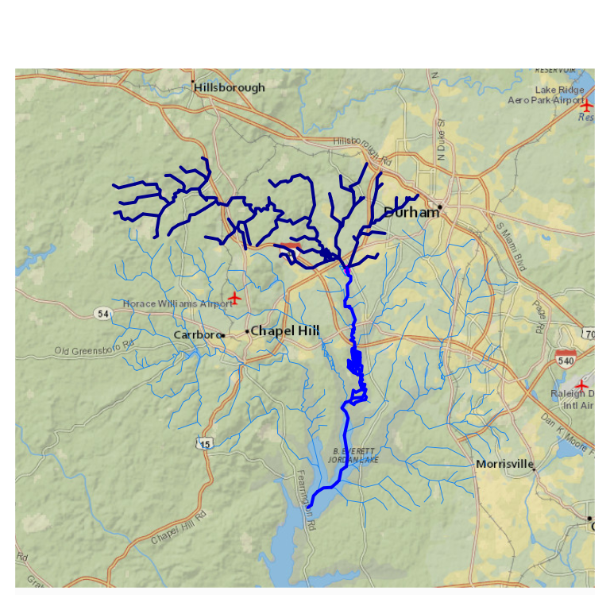
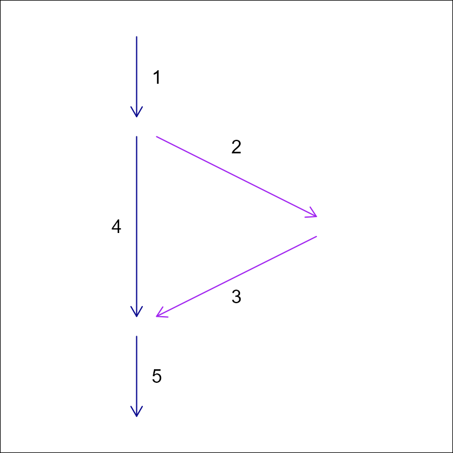
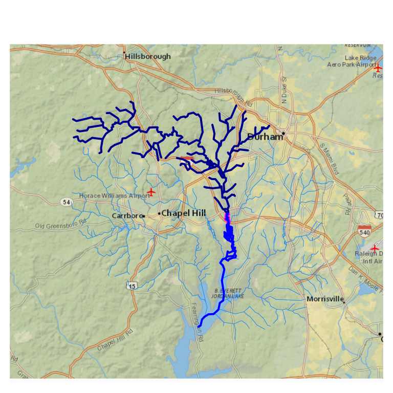

# Network Navigation

## Network Navigation

One of the most common operations with hydrologic and hydrographic
networks is referred to as “navigation”. To “navigate” the network is
the action of traversing network connections according to a set of
rules. There four primary types of network navigation, two in the
upstream direction and two in the downstream direction and only along a
main path or including branches. In `hydroloom`, these navigation types
are referred to as `upmain`, `downmain`, `up` and `down`. Additional
rules, such as a desired maximum distance, can be applied to any of the
four types.

`Hydroloom` has two functions that support network navigation.

1.  [`navigate_network_dfs()`](https://doi-usgs.github.io/hydroloom/reference/navigate_network_dfs.md),
    requires the “flownetwork” representation of a hydrologic network
    (see
    [`to_flownetwork()`](https://doi-usgs.github.io/hydroloom/reference/to_flownetwork.md))
    and returns ids encountered along the requested navigation as a list
    of contiguous paths.
2.  [`navigate_hydro_network()`](https://doi-usgs.github.io/hydroloom/reference/navigate_hydro_network.md)
    requires the nhdplus representation of a hydrologic network (see
    [`vignette("advanced_network")`](https://doi-usgs.github.io/hydroloom/articles/advanced_network.md))
    and returns ids encountered along the requested navigation as a
    single vector.

Both functions accept the same navigation mode names: `upmain`,
`downmain`, `up`, and `down`.
[`navigate_hydro_network()`](https://doi-usgs.github.io/hydroloom/reference/navigate_hydro_network.md)
also accepts the NHDPlus shorthand `UM`, `DM`, `UT`, and `DD`.

While similar, the two functions use completely different
implementations.
[`navigate_network_dfs()`](https://doi-usgs.github.io/hydroloom/reference/navigate_network_dfs.md)
uses a graph-theoretic “depth first search” with `upmain` and `downmain`
attributes for all flownetwork connections.
[`navigate_hydro_network()`](https://doi-usgs.github.io/hydroloom/reference/navigate_hydro_network.md)
relies on `topo_sort`, `levelpath`, and other nhdplus attributes to
support network navigation.

For the rest of this vignette, we will use the new_hope sample dataset
included with hydroloom. A map some basic summary information about the
data are shown just below.

``` r
library(hydroloom)
library(sf)

hy_net <- sf::read_sf(system.file("extdata/new_hope.gpkg",
  package = "hydroloom"))

nrow(hy_net)
#> [1] 746

class(hy_net)
#> [1] "sf"         "tbl_df"     "tbl"        "data.frame"

names(hy_net)
#>  [1] "COMID"      "GNIS_ID"    "GNIS_NAME"  "LENGTHKM"   "REACHCODE" 
#>  [6] "WBAREACOMI" "FTYPE"      "FCODE"      "StreamLeve" "StreamOrde"
#> [11] "StreamCalc" "FromNode"   "ToNode"     "Hydroseq"   "LevelPathI"
#> [16] "Pathlength" "TerminalPa" "ArbolateSu" "Divergence" "StartFlag" 
#> [21] "TerminalFl" "DnLevel"    "UpLevelPat" "UpHydroseq" "DnLevelPat"
#> [26] "DnMinorHyd" "DnDrainCou" "DnHydroseq" "FromMeas"   "ToMeas"    
#> [31] "RtnDiv"     "VPUIn"      "VPUOut"     "AreaSqKM"   "TotDASqKM" 
#> [36] "geom"

class(hy(hy_net, clean = TRUE))
#> [1] "hy"         "tbl_df"     "tbl"        "data.frame"

names(hy(hy_net, clean = TRUE))
#>  [1] "id"                        "length_km"                
#>  [3] "aggregate_id"              "wbid"                     
#>  [5] "feature_type"              "feature_type_code"        
#>  [7] "stream_level"              "stream_order"             
#>  [9] "stream_calculator"         "fromnode"                 
#> [11] "tonode"                    "topo_sort"                
#> [13] "levelpath"                 "pathlength_km"            
#> [15] "terminal_topo_sort"        "arbolate_sum"             
#> [17] "divergence"                "start_flag"               
#> [19] "terminal_flag"             "dn_stream_level"          
#> [21] "up_levelpath"              "up_topo_sort"             
#> [23] "dn_levelpath"              "dn_minor_topo_sort"       
#> [25] "dn_topo_sort"              "aggregate_id_from_measure"
#> [27] "aggregate_id_to_measure"   "da_sqkm"                  
#> [29] "total_da_sqkm"

# map utilities
map_prep <- \(x, tol = 100) {
  sf::st_geometry(x) |> # no attributes
  sf::st_transform(3857) |> # basemap projection
  sf::st_simplify(dTolerance = tol) # sleaner rendering
}

pc <- list(flowline = list(col = NA)) # to hide flowlines in basemap

oldpar <- par(mar = c(0, 0, 0, 0)) # par is reset in cleanup
nhdplusTools::plot_nhdplus(bbox = sf::st_bbox(hy_net), plot_config = pc)

plot(map_prep(hy_net), col = "blue", add = TRUE)
```


## NHDPlus-based network navigation.

The nhdplus data model has network attributes, like `levelpath` that
provide a shortcut to “main” navigations. A path of flowlines that flow
from a most upstream headwater to the outlet of a given `levelpath` in
the network have the same `levelpath` id. Additionally, every feature
has a `up_levelpath` and `dn_levelpath` indicating the `levelpath` of
the flowline upstream and downstream along the “main” path respectively.
These attributes, combined with relatively simple table operations,
enable navigation up and down stream along the network. While
`levelpath` attributes are the key to the algorithm, `topo_sort`,
`dn_toposort`, `dn_minor_hydro`, `length_km`, and `pathlength_km` are
also used to accomplish aspects of the algorithm implemented
in[`navigate_hydro_network()`](https://doi-usgs.github.io/hydroloom/reference/navigate_hydro_network.md).

When working with data that uses the nhdplus data model,
[`navigate_hydro_network()`](https://doi-usgs.github.io/hydroloom/reference/navigate_hydro_network.md)
works with no pre-processing. Below, all network navigation modes are
demonstrated using the sample data as is from NHDPlusV2.

First, we can extract some key features that will help illustrate the
network navigation functionality. In line comments illustrate what is
being done.

``` r
# work in hydroloom attribute names for demo sake
hy_net <- hy(hy_net)

# the smallest topo_sort is the most downstream
outlet <- hy_net[hy_net$topo_sort == min(hy_net$topo_sort), ]

# features with the levelpath of the outlet are the mainpath,
# or mainstem of the network
main_path <- hy_net[hy_net$levelpath == outlet$levelpath, ]

# the largest topo sort along the main path is its headwater flowline
headwater <- main_path[main_path$topo_sort == max(main_path$topo_sort), ]

# basemap
par(mar = c(0, 0, 0, 0))
nhdplusTools::plot_nhdplus(bbox = sf::st_bbox(hy_net), plot_config = pc)

# plot the elements prepped above
plot(map_prep(hy_net), col = "dodgerblue2", add = TRUE, lwd = 0.5)
plot(map_prep(outlet), col = "magenta", add = TRUE, lwd = 4)
plot(map_prep(headwater), col = "magenta", add = TRUE, lwd = 4)
plot(map_prep(main_path), col = "darkblue", add = TRUE, lwd = 1.5)
```

 We can
reproduce the path extracted above with a network navigation, which is a
more natural approach for most applications. Below, we see how to use
navigate_hydro_network from a starting location and use the `distance`
parameter to limit how far we will navigate from the start point.

``` r
# this is just the ids
path <- navigate_hydro_network(hy_net,
  start = outlet$id,
  mode = "UM")

# filter the source data to get the id's representation
path <- hy_net[hy_net$id %in% path, ]

# pathlength_km is the distance from the furthest downstream network outlet
# it is used within navigate_hydro_network to filter to a given distance.
pathlength <- max(path$pathlength_km) - min(path$pathlength_km)

half_path <- navigate_hydro_network(hy_net,
  start = outlet$id,
  mode = "UM",
  distance = pathlength / 2)

half_path <- hy_net[hy_net$id %in% half_path, ]

par(mar = c(0, 0, 0, 0))
nhdplusTools::plot_nhdplus(bbox = sf::st_bbox(hy_net), plot_config = pc)
plot(map_prep(hy_net), col = "dodgerblue2", add = TRUE, lwd = 0.5)
plot(map_prep(half_path), col = "magenta", add = TRUE, lwd = 3)
plot(map_prep(path), col = "darkblue", add = TRUE, lwd = 2)
```

 Now we
can look at the `up` and `down` navigation (also known as “upstream with
tributaries” and “downstream with diversions” or “UT” and “DD” in
NHDPlus). For demonstration sake, we will start at the top of the half
path found above. More typically, this would be starting from a known
location, such as where a gage site is located.

``` r
start <- half_path[half_path$topo_sort == max(half_path$topo_sort), ]

up <- navigate_hydro_network(hy_net,
  start = start$id,
  mode = "up")
up <- hy_net[hy_net$id %in% up, ]

down <- navigate_hydro_network(hy_net,
  start = start$id,
  mode = "down")
down <- hy_net[hy_net$id %in% down, ]

par(mar = c(0, 0, 0, 0))
nhdplusTools::plot_nhdplus(bbox = sf::st_bbox(hy_net), plot_config = pc)
plot(map_prep(hy_net), col = "dodgerblue2", add = TRUE, lwd = 0.5)
plot(map_prep(start), col = "magenta", add = TRUE, lwd = 4)
plot(map_prep(up), col = "darkblue", add = TRUE, lwd = 2)
plot(map_prep(down), col = "blue", add = TRUE, lwd = 2)
```

 With the
above, assuming nhdplus attributes are available, a wide range of
network navigation applications are possible. However, the sweet of
nhdplus attributes are not always available. When this is the case,
[`navigate_network_dfs()`](https://doi-usgs.github.io/hydroloom/reference/navigate_network_dfs.md)
is useful.

## flownetwork-based navigation

In contrast with
[`navigate_hydro_network()`](https://doi-usgs.github.io/hydroloom/reference/navigate_hydro_network.md),
[`navigate_network_dfs()`](https://doi-usgs.github.io/hydroloom/reference/navigate_network_dfs.md)
can perform `up` and `down` navigation with only a network topology
described as `id` and `toid`. If `upmain` and `downmain` attributes are
also available, it can also perform main path navigation.

First, it’s worth reviewing the definition of “upmain” and “downmain” in
the context of the flow network.

``` r
hydroloom_name_definitions[names(hydroloom_name_definitions) == "upmain"]
#>                                                                                      upmain 
#> "indicates that a given network element is the primary upstream connection at a confluence"
hydroloom_name_definitions[names(hydroloom_name_definitions) == "downmain"]
#>                                                                                      downmain 
#> "indicates that a given network element is the primary downstream connection at a confluence"
```

Using these definitions, we can add to the non-dendritic network example
in
[`vignette("hydroloom")`](https://doi-usgs.github.io/hydroloom/articles/hydroloom.md)
by defining “upmain” and “downmain” attributes on it. In this simple
network, we have one divergence and one confluence. Notice that where
`id` 1 appears twice, it has one and only one downmain TRUE (4) and
where `toid` 5 appears twice, it has one and only one upmain TRUE (4).



| id  | toid | upmain | downmain |
|-----|------|--------|----------|
| 1   | 2    | TRUE   | FALSE    |
| 1   | 4    | TRUE   | TRUE     |
| 2   | 3    | TRUE   | TRUE     |
| 3   | 5    | FALSE  | TRUE     |
| 4   | 5    | TRUE   | TRUE     |
| 5   | 0    | TRUE   | TRUE     |

`Hydroloom` provides utilities to construct this lightweight flownetwork
format from a geometric network in
[`make_attribute_topology()`](https://doi-usgs.github.io/hydroloom/reference/make_attribute_topology.md).
`upmain` and `downmain` attributes can be constructed using
[`add_divergence()`](https://doi-usgs.github.io/hydroloom/reference/add_divergence.md),
[`add_levelpaths()`](https://doi-usgs.github.io/hydroloom/reference/add_levelpaths.md),
and `to_flownetwork`. In this demonstration, we have `divergence` and
`levelpath` attributes already, but reconstructing them is shown below.

``` r
# select only id, name, feature_type.
# Note that the geometry is "sticky" and is included in base_net
base_net <- dplyr::select(hy_net, id, GNIS_NAME, feature_type)

# create a geometric network -- this includes divergences
base_net <- dplyr::left_join(make_attribute_topology(base_net, min_distance = 10),
  base_net, by = "id") |>
  sf::st_sf()

names(base_net)
#> [1] "id"           "toid"         "GNIS_NAME"    "feature_type" "geom"
nrow(base_net)
#> [1] 832

# now switch from a flownetwork topology to a node topology.
base_net <- hydroloom::make_node_topology(base_net, add_div = TRUE, add = TRUE)

names(base_net)
#> [1] "id"           "fromnode"     "tonode"       "GNIS_NAME"    "feature_type"
#> [6] "geom"
nrow(base_net)
#> [1] 746

# divergence determination needs a dominant feature type input
unique(base_net$feature_type)
#> [1] "StreamRiver"    "Connector"      "ArtificialPath"

base_net <- add_divergence(base_net,
  coastal_outlet_ids = outlet$id,
  inland_outlet_ids = c(),
  name_attr = "GNIS_NAME",
  type_attr = "feature_type",
  major_types = "StreamRiver")

names(base_net)
#> [1] "id"           "fromnode"     "tonode"       "GNIS_NAME"    "feature_type"
#> [6] "geom"         "divergence"
nrow(base_net)
#> [1] 746

# now we can add a dendritic toid attribute because we have "divergence"
base_net <- add_toids(base_net, return_dendritic = TRUE)

# note that no rows were added -- these are only downmain!
nrow(base_net)
#> [1] 746

# now add a length attribute as the accumulated flowline length.
base_net$length_km <- as.numeric(st_length(base_net) / 1000)
base_net$weight <- accumulate_downstream(base_net, "length_km")
#> Dendritic routing will be applied. Diversions are assumed to have 0 flow fraction.

base_net <- add_levelpaths(base_net,
  name_attribute = "GNIS_NAME",
  weight_attribute = "weight")

names(base_net)
#>  [1] "id"                  "toid"                "levelpath_outlet_id"
#>  [4] "topo_sort"           "levelpath"           "geom"               
#>  [7] "tonode"              "GNIS_NAME"           "feature_type"       
#> [10] "divergence"          "fromnode"            "length_km"          
#> [13] "weight"

# remove dendritic toid used above
base_net <- dplyr::select(base_net, -toid)

flow_net <- to_flownetwork(base_net)

nrow(flow_net)
#> [1] 832
names(flow_net)
#> [1] "id"       "toid"     "upmain"   "downmain"
```

With the above, we have a flow network. The above demonstration wasn’t
strictly necessary given that the demo NHDPlus data has all the
attributes we need to construct a flow network. However, the
demonstration shows how the NHDPlus attributes relate to the more direct
and lightweight flownetwork attributes. Note that while the hydroloom
methods are nearly identical to those of NHDPlus, there are some very
minor differences, as shown below, nearly all the upmain and dowmain
connections are the same, but differences can occur.

Comparing the two results, we see that only one junction has a different
upmain attribute. Inspection shows that the difference is due to
dendritic accumulation (diversions get 0% of the upstream value) of
flowline length in hydroloom vs un-apportioned accumulation (diversions
get 100% of the upstream value) in NHDPlus when calculating weights for
the divergence attribute and is negligible.

``` r
flow_net_nhdplus <- to_flownetwork(hy_net) |>
  dplyr::arrange(id, toid)

flow_net_hydroloom <- to_flownetwork(base_net) |>
  dplyr::arrange(id, toid)

different_downmain <- flow_net_nhdplus[flow_net_nhdplus$downmain != flow_net_hydroloom$downmain, ]

different_downmain
#> # A tibble: 0 × 4
#> # ℹ 4 variables: id <int>, toid <dbl>, upmain <lgl>, downmain <lgl>

different_upmain <- flow_net_nhdplus[flow_net_nhdplus$upmain != flow_net_hydroloom$upmain, ]

different_upmain
#> # A tibble: 2 × 4
#>        id    toid upmain downmain
#>     <int>   <dbl> <lgl>  <lgl>   
#> 1 8893470 8893552 TRUE   TRUE    
#> 2 8893472 8893552 FALSE  TRUE

different_upmain <- hy_net[hy_net$id %in% c(different_upmain$id, different_upmain$toid), ]

par(mar = c(0, 0, 0, 0))
nhdplusTools::plot_nhdplus(bbox = sf::st_bbox(different_upmain), plot_config = pc)
plot(map_prep(hy_net, 10), col = "dodgerblue2", add = TRUE, lwd = 0.5)
plot(map_prep(different_upmain, 10), col = "blue", add = TRUE, lwd = 2)
```


Now that we have a flownetwork, we can perform the same navigations as
were conducted earlier only this time, with only the basic network, not
including the NHDPlus attributes.

``` r
# this is just the ids
path <- navigate_network_dfs(flow_net,
  starts = outlet$id,
  direction = "upmain")

# filter the source data to get the id's representation
path <- hy_net[hy_net$id %in% unlist(path), ]

# distance not yet supported
half_path <- navigate_network_dfs(flow_net,
  starts = 8893396, # chosen from a map
  direction = "downmain")

half_path <- hy_net[hy_net$id %in% unlist(half_path), ]

par(mar = c(0, 0, 0, 0))
nhdplusTools::plot_nhdplus(bbox = sf::st_bbox(hy_net), plot_config = pc)
plot(map_prep(hy_net), col = "dodgerblue2", add = TRUE, lwd = 0.5)
plot(map_prep(half_path), col = "magenta", add = TRUE, lwd = 3)
plot(map_prep(path), col = "darkblue", add = TRUE, lwd = 2)
```

 Now we
can look at the `up` and `down` navigation (also known as “upstream with
tributaries” and “downstream with diversions” or “UT” and “DD” in
NHDPlus). For demonstration sake, we will start at the top of the half
path found above. More typically, this would be starting from a known
location, such as where a gage site is located.

``` r
# chosen from map
start <- hy_net[hy_net$id == 8893396, ]

up <- navigate_network_dfs(flow_net,
  starts = start$id,
  direction = "up")
up <- hy_net[hy_net$id %in% unlist(up), ]

down <- navigate_network_dfs(flow_net,
  starts = start$id,
  direction = "down")
down <- hy_net[hy_net$id %in% unlist(down), ]

par(mar = c(0, 0, 0, 0))
nhdplusTools::plot_nhdplus(bbox = sf::st_bbox(hy_net), plot_config = pc)
plot(map_prep(hy_net), col = "dodgerblue2", add = TRUE, lwd = 0.5)
plot(map_prep(start), col = "magenta", add = TRUE, lwd = 4)
plot(map_prep(up), col = "darkblue", add = TRUE, lwd = 2)
plot(map_prep(down), col = "blue", add = TRUE, lwd = 2)
```


